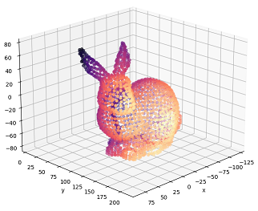

# Tutorials for pointcloud processing in Python

  

The use of pointclouds tends to increase over the years, as 3D acquisition and 3D modeling systems and software become more widely available. Pointclouds are nowadays used in many areas, such as computer-aided design, metrology, extended reality, robotics, and autonomous driving, to name just a few.

These tutorials have been created for those wishing to learn a little bit more about the basics of pointcloud processing. Having gone through this stage during my Ph.D., I hope here to share some of what I have learned so far.

The notebooks have been designed to make pointcloud processing algorithms easier to understand, without compromising performance too much and trying to minimize the use of specialized third-party software. They require basic knowledge of Python and its main scientific libraries.

## Content

Tutorials are broken down as follows:

1. Basic operations
2. Spatial indexing and features (TBD)
3. Registration (TBD)
4. Segmentation (TBD)
5. Primitive fitting (TBD)

## Dependencies

The code is in `python` and relies on `numpy`, `scipy`, `matplotlib`, and `jupyterlab`.

These dependencies may installed with `pip` with

    pip install numpy scipy matplotlib jupyterlab

or via `conda` with

    conda install numpy scipy matplotlib jupyterlab

JupyterLab may be started using the terminal or Anaconda prompt simply by typing

    jupyter lab

## Going further

The list does not pretend to be not exhaustive but may be a good starting point to dive deeper in the topic of pointcloud processing.

### Software

Libraries:

- **Open3D**, an open-source library for 3D data processing (in C++ and Python, with a 3D viewer app).
- **CGAL**, an open-source library for efficient and reliable geometric algorithms (in C++, with Python bidings)
- **PCL**, a standalone, large scale, open project for 2D/3D image and pointcloud processing (in C++, with Python bidings)
- **VTK**, an open-source software for manipulating and displaying scientific data (in C++, with wrappers in Python, Java and Tcl)
- **PyMeshLab**, a Python library that interfaces to MeshLab (see below)
- **CloudComPy**, a Python wrapper for CloudCompare (see below)

Applications:

- **CloudCompare**, an open-source 3D pointcloud (and triangular mesh) processing software (with Python scripting capabilities through **CloudComPy**)
- **MeshLab**, an open-source 3D triangular meshes (and pointclouds) processing and editing software (with Python scripting capabilities through **PyMeshLab**)
- **ParaView**, an open-source visualization application (with Python scripting capabilities)
- **Blender**, an open-source  3D computer graphics software that has pointcloud processing capabilities (with Python scripting capabilities)

### Ressources

Books:
- Goulette, F. (1999). Modélisation 3D automatique: outils de géométrie différentielle. Presses des Mines.

Videos:
- Florent Poux YouTube channel: www.youtube.com/@FlorentPoux (last accessed in August 2024)

## Citation

You are mostly free to share and reuse this work as you wish. Please do not forget to cite it if you do!

An example using BibTeX:

    @unpublished{gregorio2024tutorials,
         author={Grégorio, Jean-Loup},
         title={Tutorials for pointcloud processing in Python},
         year={2024},
    }